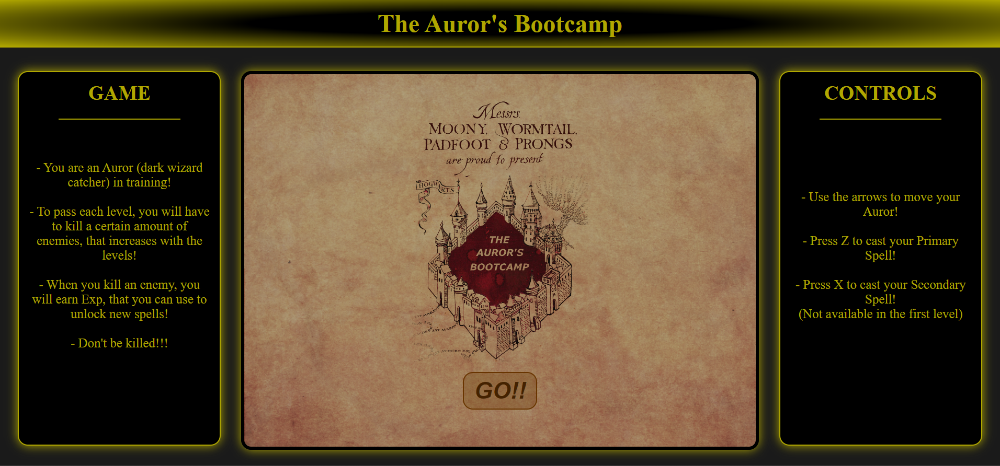

# The Auror's Bootcamp 

## Description

- The Auror's Bootcamp is a game developed using web technologies (html, css, javascript);
- It is a shooter game, where you control an Auror (dark wizard catcher) in training;
- Kill the enemies by casting spells;
- The goal is to clear the maximum number of levels you can, since there is no limit for how many levels the game can generate;
- You can buy and upgrade spells using the Exp earned in cleared levels;
- You can select up to 2 of your unlocked spells to use in the next level;

## How to play

- Use the arrow keys to move your Auror;
- Press Z to cast your Primary Spell;
- Press X to cast your Secondary Spell (wich is not available until you unlock and select a new spell);

## Presentation

- Find out more!
[Click to See Presentation!](https://slides.com/d/GQZt0I8/live)

## Demo

- Feel like trying it???
[Click to Play!](https://ismaelfreitas98.github.io/project1-javascript-game/)

## Things that I only remebered would be cool after the Code Freeze

- Implementing a fade in and fade out animation to all buttons and images in the game;

## Disclaimer

- Some of the images and names used in the game belong to the Harry Potter Franchise and I don't own them;
- This project was done for education purposes only, and it is not intended to generate any kind of profit;
- Please don't sue me :)